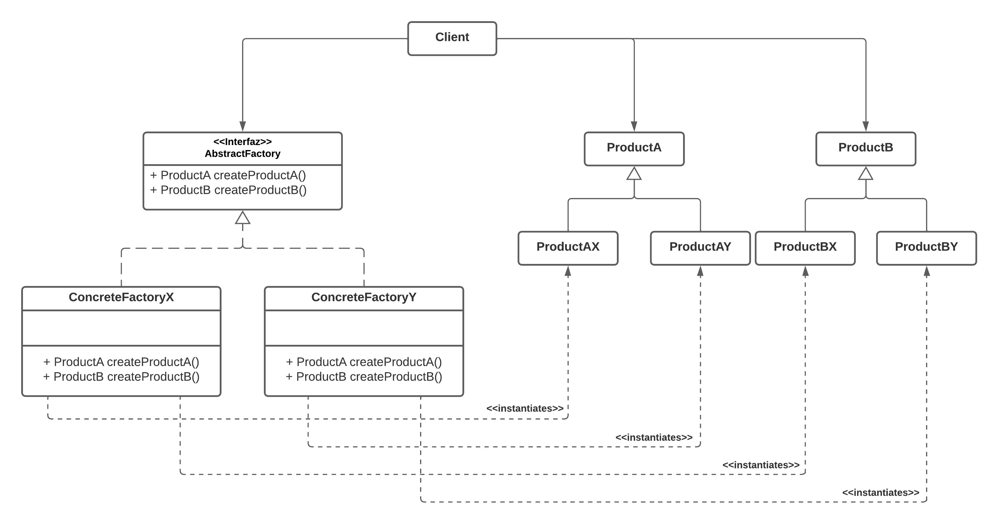

# Patron Abstract Factory

## Definicion

__*Provee una interfaz para la creacion de familias de objetos relacionadas o dependientes entre si, sin especificar su clase concreta.*__

## Estructura

### Vista estatica - Diagrama de clases UML

#### Actores

__AbstractFactory:__ Declara una interfaz para la creacion de familias de objetos a traves de sus metodos de creacion.

__ProductA y ProductB:__ Declara una interfaz para objetos de tipo Producto.

__ConcreteFactoryX y ConcreteFactoryY:__ Implementan la interfaz AsbtractFactory. Poseen la logica de creacion para cada tipo de objeto que declara cada metodo de creacion.

__ConcreteProducts:__ Implementaciones de sus respectivas intefaces. Creados mediante los metodos de creacion de las fabricas concretas.

__Client:__ Interactua con las instancias de clases concretas a traves de las interfaces AsbtractFactory, ProductA y ProductB sin importar sus clases concreta.

## Consecuencias

__*Desacoplamiento*__. El cliente solo interactua con interfaces sin conocer las clases concretas de las instancias, con lo que se evita un acoplamiento fuerte.

__*Los objetos de una fabrica siempre estaran relacionados*__. Se tiene la certeza que siempre que se utiliza una frabica, los objetos que esta produzca mantendran compatibilidad entre si.

__*Escalabilidad de familias.*__ Se pueden agregar fabricas y familias nuevas de objetos relativamente facil, sin embargo, agregar nuevos productos a las familias existentes puede resultar complejo.

