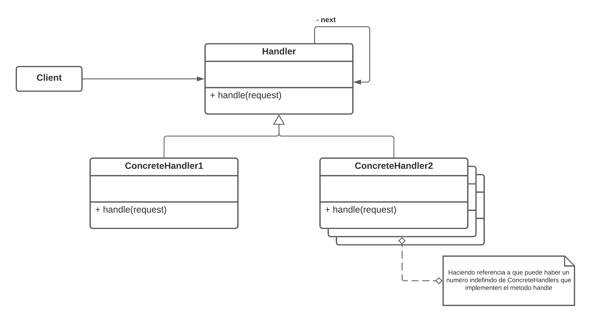
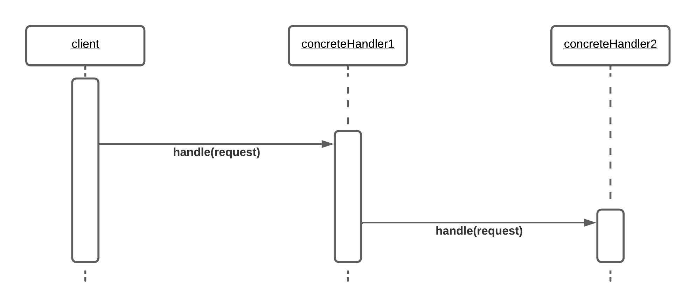

# Patron Chain of Responsibility
## Definicion
__*El patron cadena de responsabilidad, evita acoplar al emisor del receptor de una solicitud, permitiendo a mas de un objeto tener la posibilidad de responder a esa solicitud. Encadena los objetos manejadores, y pasa la solicitud a traves de la cadena hasta que alguno pueda manejarla.*__

## Estructura

### Vista estatica - Diagrama de clases UML

#### Actores
__Client:__ Genera la solicitud a la cadena mediante la abstraccion Handler.

__Handler:__ Declara el metodo __*handle*__ que sus subclases deben implementar y se asocia recursivamente consigo misma, es decir, posee un puntero hacia otro objeto Handler.

__ConcreteHandler1 y ConcreteHandler2:__ Concreciones de Handler. Implementan cada uno de forma distinta el metodo __*handle*__. En caso de poder manejar la peticion, lo hace, y de no ser asi la pasa al siguiente eslabon de la cadena mediante la referencia guardada en __*next*__.

### Vista dinamica - Diagrama de secuencia UML

Se aprecia como __client__ invoca al metodo __*handle*__ de __concreteHandler1__ con el parametro de la peticion, y esta viaja a traves de la cadena hasta que __concreteHandler2__ es capaz de manejar la solicitud.

## Consecuencias

__*Desacoplamiento entre emisor y receptor*__. Libera un objeto de tener que saber quien maneja la peticion, unicamente tiene la seguridad de que sera manejado de forma "apropiada".

__*Flexibilidad*__. Permite modificar en tiempo de ejecucion la cadena para satisfacer distintas peticiones.

__*Polimorfismo en lugar de condicionales*__. Evita la necesidad de utilizar largas sentencias if-else para determinar quien debe manejar la peticion, pasando la solicitud a lo largo de la cadena y dejando que cada objeto lo determine por su cuenta si manejarla o pasarla al siguiente eslabon.