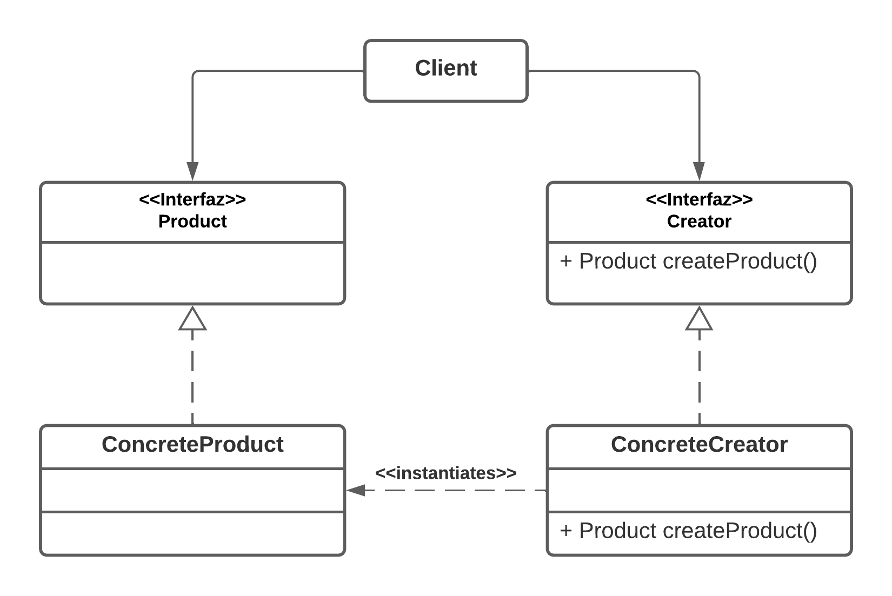

# Patron Factory Method
## Definicion

__*Provee una interfaz para la creacion de objetos, mientras que permite a las subclases decidir sobre la instanciacion concreta de los mismos.*__

## Estructura

### Vista estatica - Diagrama de clases UML

#### Actores

__Product:__ Define la interfaz para los objetos que la fabrica produce.

__Creator:__ Define la interfaz para la creacion de objetos del tipo Product.

__ConcreteProduct:__ Implementa la interfaz Product.

__ConcreteCreator:__ Implementa la interfaz Creator. Define la logica de instanciacion y retorna un objeto de tipo Product.

__Client:__ Interatua con las instancias de Creators y Products a traves de sus interfaces sin conocer sus clases concretas.

## Consecuencias

__*Desacomplamiento*__. Dado que el cliente solo interactua a traves de interfaces sin importar la concrecion con la que trabaje, esto permite una mayor mantenibilidad y escalabilidad.

__*Responsabilidad unica*__. Toda la logica de como instanciar una clase concreta determinada queda encapsulada en la fabrica concreta, lo que permite mayor mantenibilidad.

__*Escalabilidad*__. Se pueden incorporar nuevo productos y fabricas sin mayor dificultad.