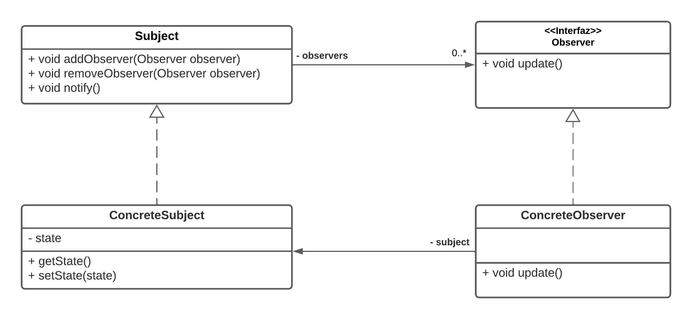
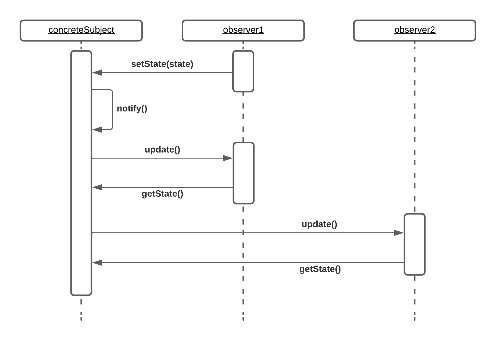

# Patron Observer
## Definicion
__*El patron observer, define una relacion de uno a muchos (1..\*) entre objetos, tal que, cuando un sujeto observable cambia de estado, todos los objetos observadores suscriptos a dicho cambio son notificados y actualizados automaticamente.*__

## Estructura

### Vista estatica - Diagrama de clases UML

#### Actores
__Subject:__ Declacra el los metodos que debe implementar la clase que posee el estado de interes, como el de agregar o quitar suscriptores al evento, ademas del metodo que notifica a los suscriptores al momento del cambio.

__Observer:__ Declara el comportamiento que debe implementar la clases interesadas en ser notificadas y actualizadas cuando ocurre un cambio en el estado de un Subject.

__ConcreteSubject:__ Implementa el comportamiento de Subject. Posee como atributos el estado de interes y una estructura de datos con los observadores suscriptos, asi como el metodo mediante el cual los observadores pueden acceder al mismo, una vez son notificados del cambio.

__ConcreteObserver:__ Implementa el comportamiento de Observer. Define el comportamiento concreto del metodo con el cual es actualizado, dado que cada Observer puede implementar distintos comportamientos segun su clase concreta.

### Vista dinamica - Diagrama de secuencia UML

En el diagrama de secuencia se puede apreciar que al momento de modificar el estado almacenado en __concreteSubject__ automaticamente se realiza una llamada al metodo __*notify*__ de la misma instancia. A continuacion, este procede a iterar sobre la lista de observadores y, mediante la invocacion del metodo __*update*__ de cada observador, hace que estos accedan al estado actualizado mediante el metodo __*getState*__ de __concreteSubject__.

## Consecuencias
__*Acomplamiento leve*__. Los sujetos notificadores no conocen las clases concretas de sus observadores, solo saben que implementan la interfaz __Observer__ y que por lo tanto disponen del metodo __*update*__. En consecuencia, existe un acomplamiento leve entre los sujetos y sus observadores.

__*Comunicacion en Broadcast*__. La tarea del sujeto observado es la de notificar a todos los suscriptos, es decir, a todos lo objetos cuya referencia se encuentre en la lista de observers, y queda a cuenta de cada observador responder o ignorar dicha notificacion.

__*Independencia entre observadores*__. Es posible agregar y quitar observadores en tiempo de ejecucion sin afectar al resto de suscriptores.

## Aplicaciones en codigo reales
- Signals en Django - https://docs.djangoproject.com/en/4.0/topics/signals/